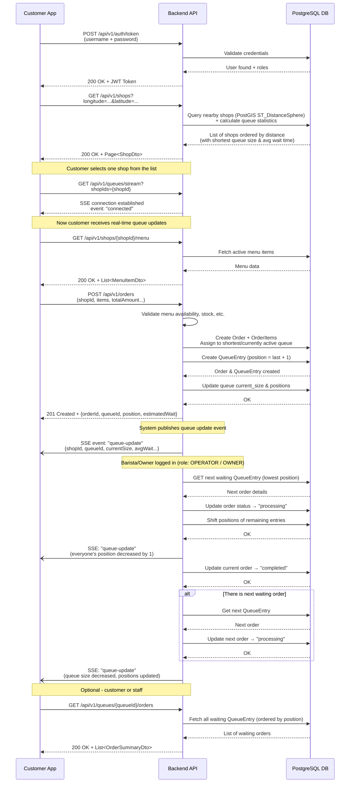

# 1 Step to run 
- Build docker image
```shell
docker build -t coffe-shop:1.0 .
```
- Run docker-compose
```shell
docker-compose up -d
```
[Swagger](http://localhost:8080/swagger-ui/index.html#)

# 2 Solution Design – Customer App & Coffee Shop App

## 2.1 Overview

This solution delivers a **robust backend system** that powers both the **Customer App** and the **Coffee Shop App** through a set of secure, well-designed RESTful APIs.

Focus areas:
- Clear separation of concerns
- High scalability
- Excellent testability
- No front-end implementation required
- All business logic is fully exposed and testable via APIs

## 2.2 High-Level Architecture
```
┌────────────────────┐               ┌────────────────────┐
│   Customer App     │               │ Coffee Shop App    │
└───────────┬────────┘               └───────────┬────────┘
            │                                    │
            ▼                                    ▼
┌─────────────────────────────────────────────────────────────┐
│                        Backend Service                      │
│                                                             │
│  • Authentication & Authorization                           │
│  • Business Logic                                           │
│  • Queue & Order Processing                                 │
│  • Data Persistence                                         │
└───────────────────────────────┬─────────────────────────────┘
                                │
                                ▼
                    ┌─────────────────────┐
                    │     PostgreSQL      │
                    │   + PostGIS (GIS)   │
                    └─────────────────────┘
```

**Architecture Style**
- Client–Server
- RESTful API-based communication
- Monolithic backend

**Core Components**
- Customer App (logical layer)
- Coffee Shop App (logical layer)
- Backend Service
- Database (PostgreSQL + PostGIS)

## 2.3 Use Cases

### Customer Use Cases

- Register new account
- Login
- Discover nearby coffee shops
- View shop menu
- Place an order
- Join queue (automatically)
- View real-time queue position & estimated waiting time
- Exit queue / cancel order

### Shop Owner / Operator Use Cases

- Login
- Configure shop details (location, contact, hours)
- Manage menu & pricing
- Configure queues (number, capacity, name)
- Monitor queue size & waiting customers
- View orders in queue
- Serve customers (advance queue)

## 2.4 Data Flow Example – Place Order & Join Queue



## 2.5 Security Design

**Authentication**
- JWT-based (stateless)
- Secure token validation

**Authorization**  
Role-based access control:

| Role       | Permissions                                      |
|------------|--------------------------------------------------|
| CUSTOMER   | Browse shops, place/cancel orders, view position |
| OPERATOR   | View & serve orders, manage queues               |
| OWNER      | Full shop management (menu, queues, config)      |

**Security Measures**
- BCrypt password hashing
- HTTPS everywhere
- Spring Security method-level & endpoint protection
- Input validation & rate limiting

## 2.6 Database Design 
[coffeshop.drawio](https://app.diagrams.net/?src=about#HToanbui97%2Fcoffe-shop%2Fdevelop%2Fcoffeshop.drawio#%7B%22pageId%22%3A%22PgOLRdoeelK9GBJZXNGs%22%7D)

## 2.7 Technology & Coding Standards

**Backend Stack**
- Java 17
- Spring Boot 3.5.9
- Spring Data JPA
- Spring Security
- PostgreSQL + PostGIS (for location-based shop discovery)
- Liquibase for database migrations

**Standards**
- RESTful naming conventions
- DTO-based request/response
- Layered architecture (Controller → Service → Repository)
- Clean code & meaningful naming
- Comprehensive logging (SLF4J + Logback)

## 2.8 API Endpoints (High-Level Summary)

### Authentication APIs

| Method | Endpoint                | Description           |
|--------|-------------------------|-----------------------|
| POST   | `/api/v1/auth/register` | Register new customer |
| POST   | `/api/v1/auth/barista`  | Register new operator |
| POST   | `/api/v1/auth/token`    | Generate new token    |


### App APIs

| Method | Endpoint                       | Description                                    |
|--------|--------------------------------|------------------------------------------------|
| POST   | `/api/v1/shops`                | Create new shop                                |
| PUT    | `/api/v1/shops/{id}`           | Update shop details                            |
| GET    | `/api/v1/shops`                | Find nearby shops with queue stat              |
| GET    | `/api/v1/shops/{id}/menu`      | View shop menu                                 |
| GET    | `/api/v1/queues/stream`        | SSE to get notification queue stat in realtime |
| POST   | `/api/v1/orders`               | Place order & join queue                       |
| PUT    | `/api/v1/orders/{id}/cancel`   | Cancel order & exit queue                      |
| PUT    | `/api/v1/orders/{id}/complete` | Complete order & exit queue                    |
| PUT    | `/api/v1/orders/{id}/serve`    | Processing order                               |
| GET    | `/api/v1/queues/{id}/orders`   | View waiting orders in queue                   |


## 2.9 Testing Strategy (API-Focused)

Since no front-end is required:

**Tools**
- Postman 
- JUnit 5 + Mockito

**Coverage Goals**
- Authentication & authorization
- API contract & response validation
- Business logic (order placement, queue assignment, wait time calc)
- Edge cases (queue full, cancel, concurrent updates)

## 2.10 Future Enhancements Roadmap
- Migrate to microservice
- Manage user session
- Push notifications ("Your coffee is ready!")
- Advanced analytics & reporting
- Customer feedback & rating after service
- Loyalty points / rewards system
- Potential migration to microservices architecture

---
